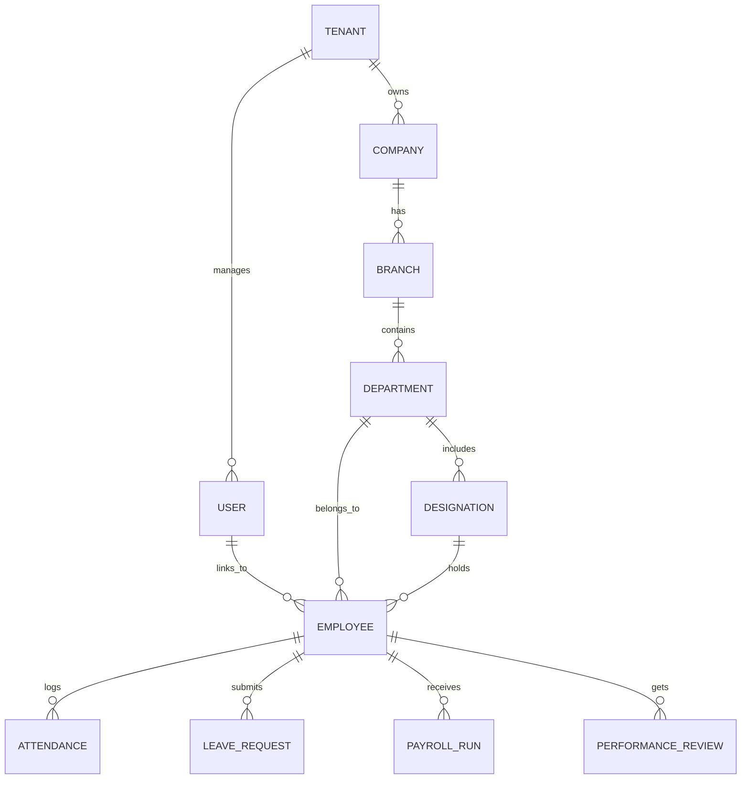

# Enterprise HRMS SaaS Platform
## Database Design & Architecture Specification

### 1. Database Overview
This document specifies the PostgreSQL 16+ database architecture for the Multi-Tenant HRMS SaaS Platform. It aligns with the hybrid multi-tenant strategy defined in the SRS (Schema-per-Tenant for Mid-Market, Database-per-Tenant for Enterprise). 

**Key Principles:**
- **Tenant Isolation:** Every table within a tenant schema strictly enforces data isolation. The `TenantId` is maintained at the application level to route to the correct schema/database, but is omitted from individual schema tables in a schema-per-tenant architecture. However, for a shared schema model, `tenant_id` is present on every table. This design assumes the **Shared Schema with Row-Level Security (RLS)** model for maximum detail, where `tenant_id` is a primary partition/index key.
- **Data Types:** Uses native PostgreSQL types (e.g., `UUID` for keys, `TIMESTAMPTZ` for dates, `JSONB` for unstructured metadata).
- **Soft Deletes:** Implemented via `deleted_at` (TIMESTAMPTZ).
- **Audit Trails:** Master audit log for CDC (Change Data Capture) / Triggers.

---

### 2. Complete ER Diagram (Core Domains)

*(Note: Full ER diagram split across domains due to complexity. See Table-by-Table spec for relationships).*

---

### 3. Table-by-Table Specification

#### 3.1 Core Setup & Multi-Tenancy

**Table: `tenants`** (Master DB only)
- Purpose: Root record for SaaS subscribers.
- Columns:
  - `id` (UUID, PK)
  - `name` (VARCHAR 255, NN)
  - `domain` (VARCHAR 255, UQ)
  - `status` (VARCHAR 50, Default 'active')
  - `created_at`, `updated_at`, `deleted_at`

**Table: `users`** (Authentication)
- Purpose: Identity management (IdP sync).
- Columns:
  - `id` (UUID, PK)
  - `tenant_id` (UUID, FK -> tenants, NN)
  - `email` (VARCHAR 255, NN)
  - `password_hash` (VARCHAR 255)
  - `role_id` (UUID, FK -> roles)
- Indexes: `idx_users_tenant_email` (Unique)

#### 3.2 Organization Management

**Table: `branches`**
- Purpose: Physical locations.
- Columns:
  - `id` (UUID, PK)
  - `tenant_id` (UUID, NN)
  - `name` (VARCHAR 255, NN)
  - `timezone` (VARCHAR 100, NN, Default 'UTC')
- Indexes: `idx_branches_tenant_id`

**Table: `departments`**
- Purpose: Organizational groups.
- Columns:
  - `id` (UUID, PK)
  - `tenant_id` (UUID, NN)
  - `branch_id` (UUID, FK -> branches)
  - `name` (VARCHAR 255, NN)
  - `parent_id` (UUID, FK -> departments, Nullable)

**Table: `designations`**
- Purpose: Job titles and bands.
- Columns:
  - `id` (UUID, PK)
  - `tenant_id` (UUID, NN)
  - `title` (VARCHAR 255, NN)
  - `level` (INTEGER)

#### 3.3 Employee Management

**Table: `employees`**
- Purpose: Core worker profile.
- Columns:
  - `id` (UUID, PK)
  - `tenant_id` (UUID, NN)
  - `user_id` (UUID, FK -> users, UQ)
  - `employee_number` (VARCHAR 100, NN)
  - `first_name`, `last_name` (VARCHAR 100)
  - `department_id` (UUID, FK -> departments)
  - `designation_id` (UUID, FK -> designations)
  - `manager_id` (UUID, FK -> employees, Nullable)
  - `hire_date` (DATE)
  - `status` (VARCHAR 50, Default 'active')
- Indexes: `idx_employees_tenant_dept`, `idx_employees_manager`

#### 3.4 Time & Attendance

**Table: `attendance_logs`**
- Purpose: Time clock entries.
- Columns:
  - `id` (UUID, PK)
  - `tenant_id` (UUID, NN)
  - `employee_id` (UUID, FK -> employees, NN)
  - `clock_in` (TIMESTAMPTZ, NN)
  - `clock_out` (TIMESTAMPTZ)
  - `location_ip` (INET)
- Partitioning Strategy: Partitioned by `RANGE (clock_in)`.

**Table: `leave_requests`**
- Purpose: Time off management.
- Columns:
  - `id` (UUID, PK)
  - `tenant_id` (UUID, NN)
  - `employee_id` (UUID, FK)
  - `leave_type_id` (UUID, FK)
  - `start_date`, `end_date` (DATE, NN)
  - `status` (VARCHAR 50, Default 'pending') # pending, approved, rejected
  - `manager_id` (UUID, FK)

#### 3.5 Payroll & Financials

**Table: `payroll_runs`**
- Purpose: Batch processing instances.
- Columns:
  - `id` (UUID, PK)
  - `tenant_id` (UUID, NN)
  - `period_start`, `period_end` (DATE)
  - `status` (VARCHAR 50)
  - `processed_by` (UUID, FK -> users)

**Table: `payslips`**
- Purpose: Individual employee pay records.
- Columns:
  - `id` (UUID, PK)
  - `tenant_id` (UUID, NN)
  - `payroll_run_id` (UUID, FK -> payroll_runs)
  - `employee_id` (UUID, FK -> employees)
  - `gross_pay`, `net_pay`, `taxes`, `deductions` (NUMERIC(12,2))
  - `breakdown` (JSONB) # Detailed line items

#### 3.6 Performance & Recruitment

**Table: `performance_reviews`**
- Columns: `id`, `tenant_id`, `employee_id`, `reviewer_id`, `cycle_id`, `rating` (NUMERIC(3,2)), `feedback` (TEXT).

**Table: `job_postings`**
- Columns: `id`, `tenant_id`, `department_id`, `title`, `description` (TEXT), `status`.

#### 3.7 System & Logs

**Table: `audit_logs`** (Recommended: Store in NoSQL/DynamoDB for scale, but if Postgres:)
- Purpose: Immutable audit trail.
- Columns:
  - `id` (UUID, PK)
  - `tenant_id` (UUID, NN)
  - `actor_id` (UUID, NN)
  - `table_name` (VARCHAR 100)
  - `record_id` (UUID)
  - `action` (VARCHAR 50) # INSERT, UPDATE, DELETE
  - `old_data`, `new_data` (JSONB)
  - `created_at` (TIMESTAMPTZ)
- Partitioning: By `RANGE (created_at)` per month.

*(Note: Other modules like Assets, Announcements, Help Desk follow identical standard patterns: `id, tenant_id, FKs, core_data, timestamps`)*

---

### 4. Database Strategies

#### 4.1 Index Strategy
- **Primary Keys:** B-Tree index automatically created on `UUID`.
- **Foreign Keys:** Explicit B-Tree indexes created for every FK to prevent table scans during JOINs.
- **Tenant Isolation:** Composite indexes always prefix `tenant_id` (e.g., `CREATE INDEX idx_emp_tenant_dept ON employees(tenant_id, department_id)`).
- **JSONB:** GIN (Generalized Inverted Index) used on `JSONB` columns for fast querying of dynamic attributes.

#### 4.2 Partition Strategy
- **Time-Series Data:** Tables like `attendance_logs`, `audit_logs`, and `notifications` will use declarative range partitioning by month or year.
- **Tenant-Level Partitioning:** If a specific tenant outgrows the shared DB, Postgres List Partitioning by `tenant_id` can easily offload them to a dedicated table/tablespace.

#### 4.3 Audit Strategy
- **Row-Level Triggers:** PostgreSQL triggers on core tables (Payroll, Employee) automatically capture `UPDATE`/`DELETE` events, convert `OLD`/`NEW` to `JSONB`, and insert into `audit_logs`.
- **Application Level:** For read-heavy or less critical tables, auditing is handled asynchronously via Kafka events.

#### 4.4 Soft Delete Strategy
- Uses a `deleted_at` column (`TIMESTAMPTZ`).
- **Implementation:** Views are created over base tables (e.g., `CREATE VIEW active_employees AS SELECT * FROM employees WHERE deleted_at IS NULL`). Application queries hit the view.
- Unique constraints must account for soft deletes: `CREATE UNIQUE INDEX uniq_email ON users(email) WHERE deleted_at IS NULL;`.

#### 4.5 Migration Strategy
- Managed via **Flyway** or **Liquibase**.
- Zero-downtime migrations required: 
  - Never use `ALTER TABLE ... ADD COLUMN ... DEFAULT` (causes table rewrite in older PG, though optimized in PG 11+, still risky).
  - Use Concurrent Index creation (`CREATE INDEX CONCURRENTLY`).

#### 4.6 Naming Convention
- **Tables:** Plural, snake_case (e.g., `leave_requests`).
- **Columns:** Singular, snake_case (e.g., `employee_id`).
- **Primary Keys:** Always `id`.
- **Foreign Keys:** `{referenced_table_singular}_id`.
- **Timestamps:** `created_at`, `updated_at`, `deleted_at`.

---

### 5. PostgreSQL Best Practices & Optimization
1. **Row-Level Security (RLS):** Apply RLS policies to enforce tenant isolation at the database kernel level:
   `CREATE POLICY tenant_isolation_policy ON employees USING (tenant_id = current_setting('app.current_tenant_id')::uuid);`
2. **Connection Pooling:** Use **PgBouncer** in transaction pooling mode to handle thousands of concurrent API connections.
3. **UUIDs:** Use `uuid-ossp` or `pgcrypto` to generate `UUIDv4` or ideally `UUIDv7` (time-ordered for better index locality and insert performance).
4. **Vacuum Tuning:** Aggressive autovacuum settings for tables with high churn (e.g., `attendance_logs`) to prevent bloat.

### 6. Scaling Strategy
- **Vertical Scaling:** Scale up compute/RAM on the primary writer node (e.g., AWS RDS r6g instances).
- **Horizontal Read Scaling:** Use PostgreSQL Streaming Replication to maintain 2-3 Read Replicas. CQRS architecture directs all reporting and analytics queries to replicas.
- **Sharding / Citus:** When the dataset exceeds single-cluster limits, migrate to **Citus** to distribute PostgreSQL horizontally across multiple nodes natively.
