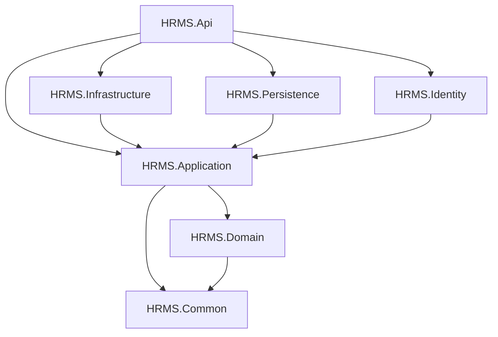
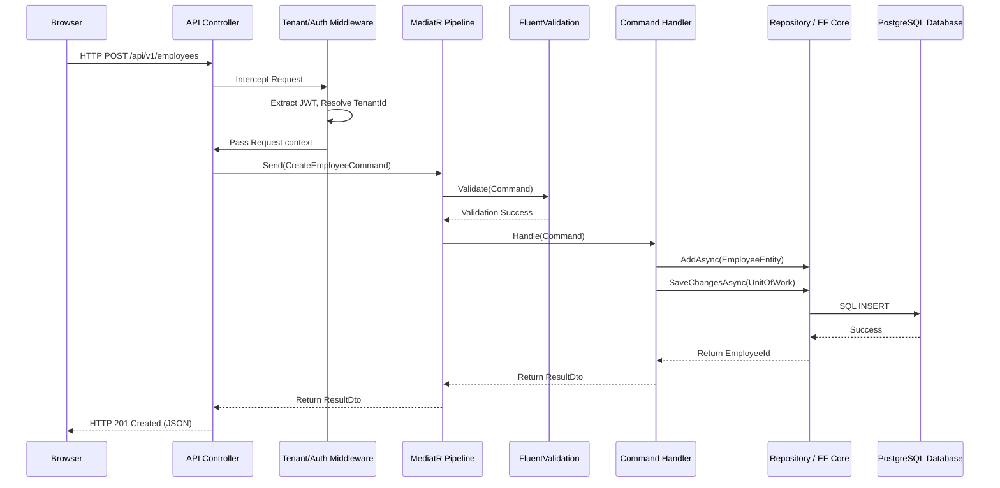
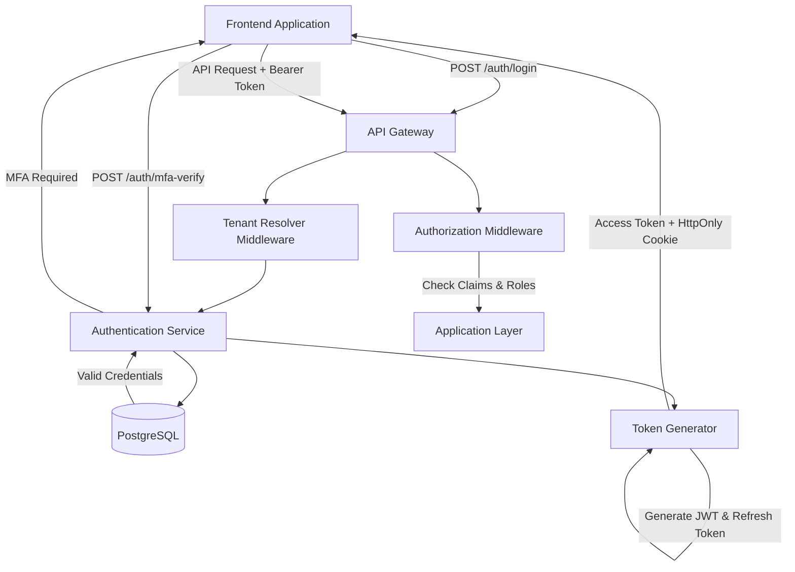

# Enterprise HRMS SaaS Platform
## Official Software Architecture & Development Guidelines

This document serves as the official architecture blueprint for the HRMS SaaS Platform. It defines the solution structure, design patterns, request flows, and technical stack to ensure a highly scalable, secure, and maintainable production environment.

---

## 1. Complete Solution Structure

The backend is built on **ASP.NET Core 9 Web API** utilizing **Clean Architecture** principles.

**Solution: `HRMS.sln`**

* **`HRMS.Api`** (Presentation Layer): Entry point of the application. Contains Controllers/Minimal APIs, Middleware, Service Registrations (Program.cs), and configuration (appsettings.json).
* **`HRMS.Application`** (Application Layer): Contains business use cases. Implements CQRS (Commands/Queries), MediatR handlers, DTOs, Validation (FluentValidation), and interfaces for infrastructure.
* **`HRMS.Domain`** (Domain Layer): Core business logic. Contains Entities, Value Objects, Domain Events, Enums, and Repository Interfaces. Has NO external dependencies.
* **`HRMS.Infrastructure`** (Infrastructure Layer): Implementation of external concerns (Email, Storage, Redis Caching, External APIs).
* **`HRMS.Persistence`** (Database Layer): EF Core DbContext, Migrations, and implementation of Repository and Unit of Work interfaces.
* **`HRMS.Identity`** (Security Layer): Manages JWT generation, Password Hashing, MFA, and SSO integrations.
* **`HRMS.BackgroundJobs`** (Worker Layer): Hangfire or Quartz.NET implementations for async jobs (Payroll runs, Leave accruals).
* **`HRMS.Shared`** / **`HRMS.Common`** (Cross-Cutting): Shared constants, generic extensions, custom exceptions, and utilities used across layers.
* **`HRMS.Contracts`** (Integration Layer): External message contracts for message brokers (Kafka/RabbitMQ) and integration events.
* **`HRMS.Tests`** (Testing Layer): Unit tests, Integration tests, and Architecture tests (NetArchTest).

### 1.1 Project Reference Diagram


*(Dependencies point strictly inward towards the Domain and Application layers).*

---

## 2. Complete Folder Structure

```text
📁 HRMS.sln
├── 📁 HRMS.Api
│   ├── 📁 Controllers (e.g., v1/EmployeesController.cs)
│   ├── 📁 Middleware (ExceptionHandling, TenantResolver)
│   ├── 📁 Extensions (ServiceCollection extensions)
│   ├── 📁 Filters (Authorization, Action filters)
│   └── Program.cs
├── 📁 HRMS.Application
│   ├── 📁 Features (Grouped by module: /Employees, /Payroll)
│   │   └── 📁 Commands (CreateEmployeeCommand.cs, CreateEmployeeValidator.cs, CreateEmployeeHandler.cs)
│   │   └── 📁 Queries (GetEmployeeByIdQuery.cs, GetEmployeeByIdHandler.cs)
│   ├── 📁 Interfaces (IRepository, IEmailService, ITenantService)
│   ├── 📁 DTOs (EmployeeDto.cs)
│   └── 📁 Behaviors (ValidationBehavior.cs, LoggingBehavior.cs)
├── 📁 HRMS.Domain
│   ├── 📁 Entities (Employee.cs, Tenant.cs)
│   ├── 📁 Enums (LeaveStatus.cs)
│   ├── 📁 Events (EmployeeCreatedDomainEvent.cs)
│   ├── 📁 ValueObjects (Address.cs, Money.cs)
│   └── 📁 Exceptions (DomainException.cs)
├── 📁 HRMS.Persistence
│   ├── 📁 Contexts (HrmsDbContext.cs)
│   ├── 📁 Configurations (EF Core Fluent API configs)
│   ├── 📁 Repositories (EmployeeRepository.cs)
│   ├── 📁 Interceptors (AuditableEntityInterceptor.cs)
│   └── 📁 Migrations
├── 📁 HRMS.Infrastructure
│   ├── 📁 Services (EmailService.cs, StorageService.cs)
│   ├── 📁 Caching (RedisCacheService.cs)
│   └── 📁 Notifications (SignalRHubs)
└── 📁 HRMS.Identity
    ├── 📁 Services (AuthService.cs, TokenService.cs)
    └── 📁 Providers (MfaProvider.cs)
```

---

## 3. Core Architectural Concepts Explained

* **Clean Architecture:** Separates concerns into distinct layers, ensuring the core business logic (Domain) is independent of UI, databases, or frameworks.
* **CQRS (Command Query Responsibility Segregation):** Separates read operations (Queries) from write operations (Commands), allowing independent optimization and scaling.
* **MediatR:** Implements the Mediator pattern, decoupling controllers from business logic by sending request objects to their respective handlers.
* **Repository Pattern:** Abstracts data access. The application layer works with `IEmployeeRepository`, oblivious to EF Core or PostgreSQL specifics.
* **Unit of Work:** Ensures that multiple repository operations participate in a single atomic database transaction. If one fails, everything rolls back.
* **Domain Events:** Triggers side-effects within the same transaction boundary (e.g., `EmployeeHiredEvent` creates a default leave balance).
* **Dependency Injection (DI):** Inverts control by injecting interfaces into constructors, making the system highly testable and loosely coupled.
* **DTOs (Data Transfer Objects):** Flat objects used to transfer data between the API and Application layers. Domain entities are NEVER exposed to the API.
* **Validation (FluentValidation):** Defined in the Application layer. Validates commands BEFORE they reach the handler via MediatR pipeline behaviors.
* **Exception Handling:** Global Middleware in the API layer catches unhandled exceptions, logs them, and returns standardized `ProblemDetails` JSON responses.
* **Logging (Serilog):** Structured logging (JSON format) pushed to Elasticsearch/Datadog. Includes context like `TenantId` and `UserId`.
* **Caching (Redis):** Distributed caching for reference data (Roles, Configurations) and query results. Cache invalidation happens in Command handlers.
* **Authentication (JWT):** Stateless JSON Web Tokens. Claims include `UserId`, `TenantId`, and `Role`.
* **Authorization (RBAC + Policies):** Checks if the JWT has the required Role and executes Policy-based checks (e.g., "Is Manager of Employee").
* **Audit Logging:** EF Core Interceptors automatically track changes to entities inheriting from `IAuditableEntity`, saving `old_values` and `new_values`.
* **Rate Limiting:** ASP.NET Core 9 built-in Rate Limiting middleware applied per Tenant/IP to prevent API abuse.
* **Versioning:** API versioning (e.g., `/api/v1/employees`) using URL segments and Swagger documentation grouping.
* **Middleware:** Intercepts HTTP requests (Tenant Resolution, Error Handling, Request Logging).
* **Swagger (OpenAPI):** Auto-generated API documentation for frontend/mobile teams to consume.
* **Health Checks:** `/health` endpoints to verify DB, Redis, and external API connectivity for Kubernetes liveness probes.
* **Options Pattern:** Binds `appsettings.json` sections to strongly typed C# classes (e.g., `JwtOptions`), injected via `IOptions<T>`.
* **Background Jobs:** Out-of-process tasks (e.g., sending emails) handled by Hangfire/Quartz.
* **SignalR:** WebSockets for real-time notifications (e.g., Chat, "Leave Approved" popups).
* **Email Service / File Storage:** Abstracted via interfaces in Application layer, implemented in Infrastructure (SendGrid/Amazon S3).

---

## 4. Complete Request Flow



---

## 5. Authentication Flow

### 5.1 Authentication Steps
1. **Login:** User submits email/password or SSO provider token.
2. **Tenant Resolution:** System identifies the tenant based on subdomain (e.g., `acme.hrms.com`) or email domain.
3. **Verification:** System verifies credentials against `users` table for the specific tenant.
4. **MFA Check:** If `require_mfa` is true, a temporary token is issued. User submits OTP to get the final JWT.
5. **Token Generation:** A short-lived Access Token (JWT) and a long-lived Refresh Token (HttpOnly Cookie) are issued.
6. **Role/Permission Checking:** The Access Token contains `role` and `permissions` claims. The `[Authorize]` attribute in ASP.NET Core checks these claims before allowing API access.
7. **Company vs Employee Login:** Both use the same `/auth/login` endpoint, but RBAC determines their dashboard and available API routes post-login.

### 5.2 Authentication Diagram



---

## 6. Development Guidelines for Engineers

1. **Never inject DbContext directly into Controllers.** Always use MediatR.
2. **Never expose Domain Entities.** Always map to DTOs using Mapster or AutoMapper.
3. **Tenant Context is King.** Ensure `ITenantProvider.TenantId` is used in every database query. EF Core Global Query Filters must be configured to automatically append `WHERE TenantId = @id`.
4. **Thin Controllers.** Controllers should only map HTTP requests to Commands/Queries and handle HTTP status codes.
5. **Rich Domain Models.** Business logic belongs in the Domain Entities (e.g., `employee.Promote(newDesignation)`), not in application services.

This architecture ensures the HRMS platform can scale horizontally, maintain strict data isolation, and allow teams to work concurrently on different modules (e.g., Payroll team vs ATS team) with minimal conflicts.
